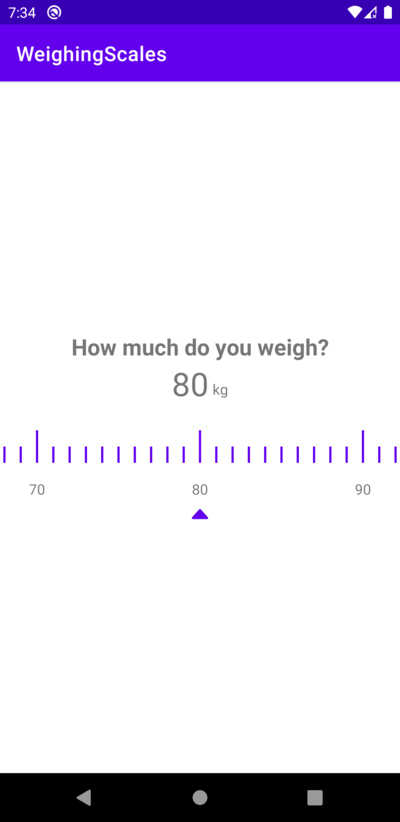

# Weighing Scale Component

A simple component from the [Drynk app](https://play.google.com/store/apps/details?id=com.syzible.drynk) to select a value from a preset list. Useful for onboarding users. 



## Quickstart
Add the following to your `app/build.gradle`

```gradle
implementation com.syzible.weighingscales@aar:1.0.0
```

To use the component in your app, add a recycler view component to a layout
```xml
 <androidx.recyclerview.widget.RecyclerView
   android:id="@+id/weight_recycler_view"
   android:layout_width="match_parent"
   android:layout_height="wrap_content"
   android:clipToPadding="false"
   android:scrollbars="none" />
```

Then bind this in your view using something like Butterknife, view binding etc.

Make sure your activity/fragment implements the interface MovementListener.
```java
class MainActivity extends AppCompatActivity implements ScaleSliderLayoutManager.MovementListener { 
  ...
}
```

In a lifecycle hook, instantiate the adapter and set the adapter's dataset with the following

```java
@Override
protected void onStart() {
  super.onStart();

  int padding = Screen.getScreenWidth(this) / 2;
  binding.weightRecyclerView.setPadding(padding, 0, padding, 0);

  ScaleSliderAdapter adapter = new ScaleSliderAdapter();
  adapter.setData(repo.getWeightLabels());

  ScaleSliderLayoutManager layoutManager = new ScaleSliderLayoutManager(this, this);
  binding.weightRecyclerView.setLayoutManager(layoutManager);
  binding.weightRecyclerView.setItemAnimator(new DefaultItemAnimator());
  binding.weightRecyclerView.setAdapter(adapter);

  binding.weightRecyclerView.scrollToPosition(repo.getStartWeight() - 1);
  setWeightLabel(repo.getStartWeight());
}
```

You can then use the hook `onItemChanged` to update labels on the user swiping horizontally.

## Customisation
You can use the following methods to customise the adapter
```java
ScaleSliderAdapter adapter = new ScaleSliderAdapter();

adapter.setData(List<String> data); // default is an empty list
adapter.setSpokeColour(String hex); // default is purple-500
adapter.setSpokeColour(int colour);
adapter.setCountBetweenMarkers(int count); // default is 10
adapter.setLongSpokeHeight(int dp); // default is 32dp
adapter.setShortSpokeHeight(int dp); // default is 16dp
```

### PRs
Feel free to create a PR if you want to add new functionality.
